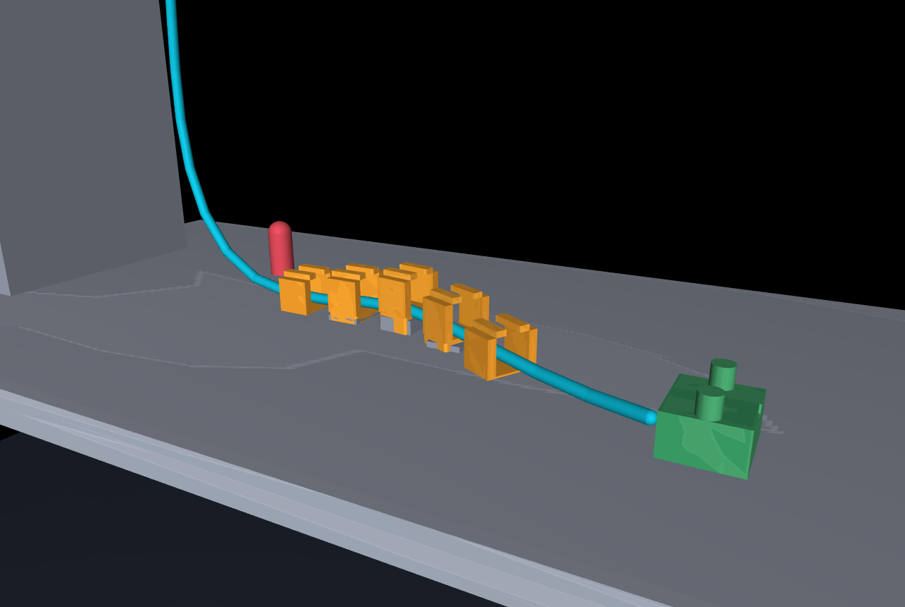

# Constrained-cable safety

A robot pushes a plug into a socket. The plug's cable is clipped to a board on the
way in, the way wiring is dressed inside a machine. When the plug does not go in
and the robot pulls back to try again, it can drag the cable out of one of those
clips — undoing work it had already done.

This repository is about the small piece of software that is supposed to stop
that: what it has to know, how simple it can be, and the point at which it
quietly stops being worth anything.

Everything here is simulation — MuJoCo, a UR5e arm, and connector models from the
[Intrinsic Assembly Industrial Benchmark](https://github.com/intrinsic-ai/assembly-industrial-benchmark).
Four studies. Each one had its question, its method and its pass/fail criteria
written down and committed to git *before* any of it ran, so the result could not
be chosen after the fact.



The one-sentence answer: **use the check's ranking of moves, not its yes/no
threshold** — the ranking still works on a rig the check was never tuned for,
and the threshold does not.

## Five minutes, from a cold checkout

Both of these need a checkout and a Python environment with numpy, and nothing
else. No simulator, no GPU, no network, a second each.

```powershell
.venv/Scripts/python.exe scripts/verify_findings.py
```

Prints the four findings and re-derives each one from the record it came from,
applying that study's own pass/fail rule to its own numbers. It exits non-zero
if a verdict no longer follows from the record beside it, so it is a check and
not a summary.

```powershell
.venv/Scripts/python.exe scripts/try_the_safety_check.py
```

Runs the check itself. It loads the five-clip rig, hands the check the estimate
the study's own job held at its first retreat decision, and prints what the
check allows at each of the three eyesight levels, which of the three limits is
closest to breaking, and how much of each budget the chosen move spends. It
finishes by comparing its own arithmetic against what that job recorded, and
exits non-zero if the two disagree.

**To use the check on your own rig** you supply, at each decision, where the
cable leaves the plug, where it is clamped, the direction the plug is being
pushed in, the direction the cable runs — and what your estimator says about its
own error, which is what sizes the margin. The threshold itself is a property of
this cable on the rig it was fitted on, so yours would have to be fitted the same
way. Finding 3 below is what happens when it is not.

Everything further down that starts `.deps/cable-venv` needs MuJoCo in a second
environment; nothing above this line does.

This repository also holds a **retired peg-insertion campaign**, which asked the
same question on a different robot and closed by deciding its own premise was
wrong. That is a real result and it is kept as one:
[docs/PEG_INSERTION.md](docs/PEG_INSERTION.md). Its sibling repository,
[orbital-robotic-servicing-lab](https://github.com/tryaksh/orbital-robotic-servicing-lab),
is about servicing spacecraft racks in zero gravity and shares no subject matter
with this one; [docs/REPO_MAP.md](docs/REPO_MAP.md) explains how the two were
separated.

---

## The problem

Pushing a connector home is fiddly and often fails on the first try. The standard
recovery is to pull back a few centimetres and come at it again. That retreat is
where the damage happens: the cable behind the plug is already clipped down, and
pulling the plug away drags on it.

So before each retreat the robot should ask: **would this particular move break
something?** That question is the whole project.

### Three things can break

| | Limit | Why that limit |
| --- | --- | --- |
| **The cable comes out of a clip** | there is only so much slack | This is the one everything turns on. Pull harder than the slack allows and the cable lifts out of the channel. |
| **The cable is bent too tightly** | bend radius below **40 mm** | The usual industrial rule for a jacketed cable being *moved* is 10–15× its outside diameter. This cable is 4 mm across. |
| **The clamp takes too much pull** | above **0.30 N** | The cable's own weight is 0.49 N, so this is the point where the robot is hauling on the far end rather than just holding it. |

Every run is scored against all three. In the code and the records they are
called C1, C2 and C3, in that order.

---

## Five ways to build the check

The check reads the robot's *estimate* of where things are — not the truth,
because a real robot does not have the truth — and says yes or no to a proposed
move.

The cheapest version is close to trivial: measure the straight-line distance from
where the cable leaves the plug to where it is clamped, work out what that
distance *would be* if the move happened, and refuse the move if it goes past a
threshold. One number. The most expensive reads all 24 estimated points of the
cable's shape through a neural network.

The simple one also carries a **margin** — it backs its threshold off by an
amount the estimator itself reports, so the worse the robot's eyesight, the more
cautious the check automatically becomes.

| The check | How big | Wrong with perfect information | Wrong with large error |
| --- | --- | --- | --- |
| **one distance, plus a margin** | **1 number** | **13%** | **22%** |
| force sensing only, no vision | 10 numbers | 12% | 20% |
| eighteen hand-designed features | 19 numbers | 14% | 19% |
| a network over the whole cable shape | 28,033 numbers | 21% | 29% |
| the same network, plus a short history | 34,689 numbers | 23% | 31% |

*"Wrong" means the check approved a move and the cable came out anyway.* Every
check is held to the same number of approved moves, so none of them can look good
by simply refusing more of them. The moves were all on rig layouts the check had
never been tuned on: 960 moves in the perfect-information column and 865 in the
large-error column, 16,080 runs in total. The two columns have different
denominators because a run that never got as far as a repair decision has
nothing to score, and it is dropped rather than counted as safe — 15,476 of the
16,080 produced a decision to score.

**Nothing beats the simple one by enough to call it a win** — at any level of
eyesight, on any of the three failure modes. "By enough" is not a judgement call:
each study fixed in advance how big a difference has to be before it counts, and
nothing cleared that bar.

Read the other way, the network is measurably *worse* at protecting the clips, by
about 7 percentage points (plausible range 1 to 15, not including zero). That
comparison was not part of the registered question, so it is reported rather than
claimed.

[Record](evidence/cable_perception_v4.json) ·
[what was frozen first](configs/cable_perception_v4.json)

### How bad the robot's eyesight was made

A check is only as good as what it looks at. Rather than build a camera, the
study *declares* how wrong the robot's estimate is and makes it that wrong — with
the error concentrated exactly where a real fixture would hide the cable from a
real camera.

| How good the eyesight is | What that means | Label in the records |
| --- | --- | --- |
| perfect information | the check is handed the simulator's exact truth | `E0` |
| small error | socket off by 0.5 mm, hidden cable points off by 1 mm, about 1 point in 20 missing | `E2` |
| large error | socket off by 2 mm, hidden cable points off by 4 mm, about 1 point in 5 missing | `E4` |

This is a model of **how perception fails**, not a camera. No image is ever
rendered and no pose estimator is built or tested here.

---

## What was found

### 1. For a single move, the simplest check wins

The table above. One number carrying a margin sized from what the estimator says
about its own error is not beaten by anything richer.

### 2. Over several moves, the check earns its keep

One move is not a job. A real recovery is a few moves in a row, and each one
spends slack the next one is judged against. Three moves per run, on layouts the
check had never been tuned on. The numbers are runs that lost the cable out of
a clip:

| What the robot does | Perfect information | Small error | Large error |
| --- | --- | --- | --- |
| no check, biggest move every time | **80 of 80** | **80 of 80** | **80 of 80** |
| the check, biggest move it allows | 32 of 80 | 33 of 58 | 36 of 66 |
| the check, move with the most room left | **8 of 80** | **10 of 63** | 37 of 79 |

Without the check the cable came out **every single time** — 240 runs out of 240.
This is where the simple check is clearly worth having.

720 runs, 2,160 decisions.
[Record](evidence/cable_sequence_v5.json) ·
[contract](configs/cable_sequence_v5.json)

### 3. On a different rig, it stops working

The first two findings came from a rig with *one* clip. Real wiring runs through
several. So the same check, unchanged and not re-tuned, was put on the five-clip
rig at the top of this page, where finishing the job now means all five clips
still held and the plug seated.

It stopped helping. Not "helped less" — stopped. With the check and without it,
the robot does the same thing: one big move, and the cable comes out on it.

Two measurements, both taken before anything was scored, say why:

| | |
| --- | --- |
| what the five-clip rig will physically take | about **18 mm** of pull-back |
| what the check allows on it | **58 mm**, and 11 of its 12 candidate moves |

The threshold was fitted on the one-clip rig, where a lot of cable could
straighten out and absorb the pull. Five clips pin the cable down so almost none
of it can, and the check has no way to know that.

Each cell below is the three eyesight settings in order — perfect, small error,
large error — over 780 jobs per row:

| Over a five-clip job | Share that lost the cable out of a clip | Jobs finished |
| --- | --- | --- |
| no check, biggest move every time | 0.667 / 0.636 / 0.489 | **0 / 0 / 0** |
| the check, biggest move it allows | 0.667 / 0.611 / 0.497 | **0 / 0 / 0** |
| the check, move with the most room left | 0.333 / 0.314 / 0.353 | 20 / 76 / 9 |

Having the check changes the clip-loss rate by +0.000, +0.025 and −0.008. All
three are smaller than the difference the study said in advance would have to be
cleared before it counted as a difference at all.

One more thing worth knowing: **the clip that lets go is almost always the same
one**, the raised one at the top of the small ridge — 1,017 of 1,144 losses,
against 127 for the clip nearest the plug and none at all for the other three.

2,340 runs, 11,700 decisions, 266.8 million simulation steps, 87 minutes of wall
clock. No run touched the answer key and no run edited the simulator's state
mid-job; both are checked continuously and neither ever fired.
[Record](evidence/cable_routing_v6.json) ·
[contract](configs/cable_routing_v6.json)

---

## What to do instead

A check like this is two things wearing one coat. It is a **rule** — yes or no,
is this move under the threshold. And it is an **ordering** — of the moves
available, which one leaves the most room to spare.

The rule did not survive the move to a new rig, because the threshold was
measured on different geometry. The ordering did:

| | Jobs finished, taking the move with the most room left |
| --- | --- |
| perfect information | **20 of 60** |
| small error | **76 of 360** |
| large error | 9 of 360, where the advantage mostly disappears |
| either "biggest move" version, any eyesight | **0 of 1,560** |

This one was written down before the runs, including the part about it fading at
large error. It is the single claim here that survived as a formal result rather
than an observation.

> **How much you take matters more than what you check with.**

---

## What you can run

```powershell
.venv/Scripts/python.exe -m pytest                          # 491 tests, no GPU, no simulator, ~5 s
.venv/Scripts/python.exe scripts/summarize_perception_v4.py # study 1, in a paragraph
```

[`SafetyFilter`](src/assembly_recovery/cable_safety_filter_v4.py) is the check
itself, packaged. It reads its thresholds straight out of the evidence file, so
the published number and the running code cannot drift apart. It scores all three
failure modes, names which one binds, maps the whole space of allowed moves in
one call, and reports how much of each budget a move spends.

### The workbench

The rig is defined in config, not code, so the obvious question is what happens
to a *different* rig. [`scripts/workbench.py`](scripts/workbench.py) is the tool
for asking. It loads the measured rig, lets you move, add or remove a clip or
change the installed slack, ask the safety layer what it would allow, and run the
job once.

```powershell
.deps/cable-venv/Scripts/pythonw.exe scripts/workbench.py                       # what is loaded
.deps/cable-venv/Scripts/pythonw.exe scripts/workbench.py --level E4 --allowed  # what is allowed
.deps/cable-venv/Scripts/pythonw.exe scripts/workbench.py --move c3:up_m=0.009 --run
.deps/cable-venv/Scripts/pythonw.exe scripts/workbench.py --add-clip c6:along_m=0.21 --run
.deps/cable-venv/Scripts/pythonw.exe scripts/workbench.py --run --view          # with MuJoCo's viewer
```

Change the rig and the tool will not run the job until it has re-run the
**install check** — a six-second test that settles a cable into the rig and
confirms it actually stays in every clip. A rig that builds is not a rig a cable
installs into: the same check rejected 19 of the 28 candidate rigs it was given.
In practice most changes come back "no", and that is the answer you wanted before
cutting metal.

`--self-check` proves the tool is showing the rig it names. It checks three
things: the job it sets up matches the one the study ran in every field; re-doing
the install check on the unmodified rig gives the same numbers as
[the record](evidence/cable_cell_screen_v6.json), to the last digit; and
re-running the job gives the same result the study recorded, including how much
slack was left at each of the five decisions.
[Record](artifacts/showcase/tool.json).

The interactive window has never been run — the machine this was written on has
no display. Everything behind it is headless and unit tested; the window itself
is one call to MuJoCo's `launch_passive`.

### The page, the clips and the renders

Each of these writes a small record saying what it checked and what it produced,
and those records are in the repository. **What they produce is not** — the page,
the frames, the encoded video and the USD stage are generated output, they are
large, and they are rebuilt by running the script again.

| | |
| --- | --- |
| **The page** | `scripts/build_showcase.py` generates `artifacts/showcase/index.html` from ten committed records. Nothing on it is typed by hand: change a number in a record, rebuild, and the page changes. It is a local file and is not published anywhere. [Record](artifacts/showcase/page.json) |
| **Replay clips** | `scripts/render_routing_video_v6.py` re-runs a registered job through the study's own control loop and refuses to render it unless it reproduces the recorded outcome exactly. Checked by decoding the written files, not by trusting the encoder. [Record](artifacts/showcase/video.json) |
| **USD export** | `scripts/export_usd_v7.py` writes one job out as a USD stage so it can be re-rendered elsewhere. [Record](artifacts/showcase/usd.json) |
| **Isaac Sim render** | `scripts/render_isaac_v7.py` re-renders that stage with RTX lighting, because MuJoCo's built-in renderer is for checking a scene is right, not for looking at. Rendering only — the physics and every number are unchanged. [Record](artifacts/showcase/isaac.json) |

---

## Why the numbers are trustworthy

- **The question was written down and committed before the runs started.** Nine
  predictions across the four studies; three were right. The six that were wrong
  are still in the record, with what they taught.
- **The code being tested cannot read the answer key.** A guard fails any run
  whose control code touches the truth. A deliberate cheating run confirms the
  guard fires; it never fired on a real run.
- **Nothing was graded twice.** All 16,080 runs of the first study were re-scored
  from the raw logs alone by separate code: 26,652 comparisons, zero
  disagreements. [Record](evidence/cable_perception_replay_v4.json)
- **A study cannot ask a question it is too coarse to answer.** The margin a
  difference has to beat must be at least twice the measurement's own resolution,
  checked in code. It refused 3 of 15 comparisons outright rather than answer
  them badly.
- **Runs cut short do not count as successes.** A move that aborted never got the
  chance to break what it had not broken yet, so it is excluded rather than
  scored as safe.
- **Rejections are kept.** The screen that chose this rig rejected 19 of 28
  candidates, all in the record with reasons.

---

## What this is not

Simulation only. No hardware, no real connector, no electrical test, no released
or latched connection, no learned grasping, no force-certified safety claim. What
is measured is one narrow thing: the plug reaches the socket and stays there for
half a second while every required clip still holds the cable, with the robot
still gripping the plug.

One task, one connector, one cable model, two rigs. "One number is enough" is a
measured statement about a single move on the first rig — and finding 3 is the
measurement of where that stops being true. A finding on the five-clip rig is a
statement about *that rig*.

---

## Where everything is

| Need | Read |
| --- | --- |
| What is open and what is closed | [ROADMAP.md](ROADMAP.md) |
| Which branches exist, and what came from where | [docs/REPO_MAP.md](docs/REPO_MAP.md) |
| The retired peg-insertion campaign | [docs/PEG_INSERTION.md](docs/PEG_INSERTION.md) |
| Which record answers a question | [evidence/INDEX.json](evidence/INDEX.json) |
| Operating rules and the full command sequence | [AGENTS.md](AGENTS.md) |
| The rig, in config | [configs/cable_cell_v6_candidates.json](configs/cable_cell_v6_candidates.json) |
| The decision log for the last session | [artifacts/showcase/PROGRESS.md](artifacts/showcase/PROGRESS.md) |
| Past session handovers, kept as history | [docs/handover/](docs/handover/) |

Every evidence record carries its own declared scope. Read it before quoting a
number out of it.

**`evidence/` holds two campaigns.** Every entry in
[`evidence/INDEX.json`](evidence/INDEX.json) carries a `campaign` field: 30
records from the cable studies this page is about, 66 from the retired peg
campaign, and 3 describing both. A peg number is not a cable number.
