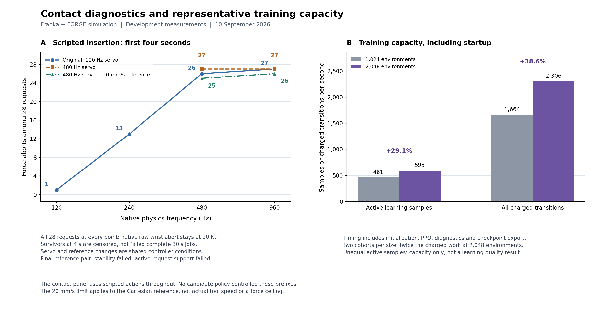

# The retired peg-insertion campaign

This is the other recovery study this project ran, before the cable work. It was
closed on 2026-09-10 by deciding that its own premise was wrong. That is an
unusual way for a study to end and it is worth reading, because the reason it
closed is a result in itself.

Its records live in [`evidence/`](../evidence/) alongside the cable records —
65 of them, every one tagged `"campaign": "peg"` in
[`evidence/INDEX.json`](../evidence/INDEX.json). Nothing here has been retracted
or reworded. **Peg numbers are not cable numbers and must never be quoted as
such.**

---

## The task

A Franka Panda robot arm holds a cylindrical **peg** and pushes it down into a
matching **hole**. The clearance between them is 57 micrometres — about the
width of a human hair — so the peg has to be lined up very well or it jams
against the rim instead of going in.

This is the standard laboratory test for contact-rich assembly, and it is the
same shape of problem as the cable work in this repository: an insertion is
attempted, it fails, and something has to happen next.

The simulator was NVIDIA **Isaac Lab**, using its **FORGE** task — an existing,
published setup for force-aware assembly learning, taken as it came rather than
rebuilt. The robot was trained with **PPO** (Proximal Policy Optimisation), a
standard reinforcement-learning method: the robot tries the task many millions
of times and gradually adjusts its behaviour towards whatever earns reward.

A few terms that show up in every record:

| Term | What it means |
| --- | --- |
| **native physics rate** | How many times a second the simulator recalculates forces and motion. 120 Hz is coarse; 960 Hz is fine. Finer costs more and is generally more faithful. |
| **servo rate** | How often the controller updates the arm's target. Separate from the physics rate, and the gap between the two turned out to matter. |
| **force abort** | The run was stopped because the load measured at the wrist went over 20 N. A safety rule, frozen before the runs, never relaxed. |
| **witnessed contact stall** | The peg is pressed against the hole, going nowhere, and still held — a genuinely stuck attempt. This is the situation the whole study was built to measure recovery from. |
| **charged transition** | The unit of simulator spend, so two methods can be compared at equal cost. One charged transition is eight simulated physics steps. The campaign spent about 27.9 million of them. |
| **the prefix** | A four-second scripted insertion attempt run *before* the thing under test takes over, used to manufacture a stuck peg on purpose. |

---

## The question it registered, and why it closed

**The question.** At equal total simulator cost, does deliberately showing a
learning robot physically generated *failed* insertion attempts make it more
reliable at recovering from them, compared with ordinary training on randomly
faulted attempts?

The design was clean. Both arms use the same policy, the same observations, the
same faults and the same reward. The only difference is that the candidate arm
spends half its fault training on jobs that begin with a scripted failed attempt.
The scripted part is excluded from learning but its simulator cost is still
charged, so neither arm can win by spending more.

**Why it closed.** To compare recovery, you need failures to recover *from* —
specifically, pegs that are stuck against the hole and still held. At the coarse
120 Hz physics the study started on, there were plenty: 17 of 28 development
cases ended the four-second prefix in a witnessed contact stall.

Then the physics was refined, which is the ordinary thing to do when you want to
trust a simulation. The failure cohort vanished:

| Native physics rate | Force aborts out of 28, original 120 Hz servo | with a 480 Hz servo | with a 480 Hz servo and a 20 mm/s reference limit |
| --- | --- | --- | --- |
| 120 Hz | 1 | not run | not run |
| 240 Hz | 13 | not run | not run |
| 480 Hz | 26 | 27 | 25 |
| 960 Hz | 27 | 27 | 26 |

*The same table drawn, with the campaign's other surviving measurement beside
it. Panel A: as the physics goes from 120 Hz to 960 Hz, the number of the 28
development cases that end in a force abort rather than a stuck peg climbs from
1 to 27, and neither correction pulls it back down. Panel B is unrelated to that
and is the engineering measurement worth keeping: doubling the number of
simulated environments from 1,024 to 2,048 buys 29.1% more useful samples a
second.
[Record](../evidence/research_cycle_figure_v1.json)*

At fine resolution the peg does not get stuck — it hits the rim hard enough to
trip the 20 N wrist limit and the run is aborted. There is nothing left to
recover from. Two standard corrections were tried against this, each registered
before it ran: raising the servo rate to 480 Hz, and then also limiting how fast
the controller's target may move (20 mm/s). Neither brought the stalls back.

The registered stopping rule said: if the final correction fails its gate, stop.
It failed. The design required at least 8 cases still active at the end of the
prefix; the final pair left **2 and 1**. So the campaign stopped there, and the
candidate method was **never trained and never evaluated**.

> **The bounded result is this:** the assay loses the failures it was built to
> measure as soon as the physics is refined, and two common control corrections
> do not restore them. Whether the candidate method works is still unknown. The
> study does not claim it does not.

[The executed decision and cost ledger](../evidence/research_cycle_decision_v1.json) ·
[the registered design](../configs/recovery_teaching_registration_v1.json) ·
[the final reference-limited comparison](../evidence/approach_slew_comparison_v1.json) ·
[the verification](../evidence/research_cycle_verification_v1.json)

### What is *not* being claimed

The records are careful about this and so is this page. The campaign did not show
that learning from your own failures is a bad idea, that FORGE or Franka tasks do
not work, or that finer physics is the truth and coarser physics is a lie. Two
resolutions establish that the outcome is *sensitive* to resolution. They do not
establish which one is right. The exact mechanism is unresolved.

---

## What it produced that is worth keeping

Four things came out of it that stand on their own.

**1. A policy that can actually do the task.** Ordinary uniform-fault training
with completion credit and unclipped value regression, 10.33 million charged
transitions in 111.5 minutes, finished **81 of 84** development jobs — 12 of 12
clean cases and 69 of 72 faulted ones. One training seed and three development
seeds, so this is a development result, not a final test.
[Record](../evidence/uniform_unclipped_v4.json)

**2. Learned recovery did not beat simply retrying.** Given the same 17 genuinely
stalled jobs, the learned policy finished 13 and an unchanged scripted
retract-and-retry also finished 13, while carrying straight on finished 0. Two
further seeds agreed: 30 of 37 against 31 of 37 for retry, 1 of 37 for carrying
on. The learned policy was about a third faster on average, and that is the only
difference anyone should quote.
[Record](../evidence/post_stall_confirmation_v2_verified.json)

This matters for the cable work: it is the same shape of answer. *Doing the
obvious simple thing is hard to beat.*

**3. The original competence gate stayed failed, and was not moved.** The study
counted a recovery only if the robot withdrew at least 5 mm before retrying. The
learned policy recovers by sliding sideways instead — up to 9 mm lateral, under
1.1 mm of lift — so by the registered definition it scored **zero** withdrawal
recoveries. The definition was not rewritten afterwards to make the number look
better. A separate, mechanism-neutral endpoint was registered instead, and
reported separately.

**4. Two engineering measurements that saved real time.**

- **Batch size.** Running 2,048 simulated environments at once rather than 1,024
  gives 29.1% more useful samples a second and 38.6% more charged transitions a
  second, at 6,499 MiB of GPU memory. [Record](../evidence/training_capacity_v2.json)
- **Value clipping was hurting.** A controlled test at equal optimiser work cut
  the critic's fit error from 222.58 to 10.43 by removing value clipping.
  [Record](../evidence/critic_fit_v1.json)

---

## Honest gaps

- **The raw run artifacts are not in this repository, or in any repository.**
  About 865 MB of trajectories, physics samples and per-case logs sit in
  `D:/6axis-space-robotics/artifacts/` on the workstation that produced them,
  untracked. Every evidence record carries the sha256 hash of the artifacts it
  was derived from, so they can be checked against the records if the machine
  survives, and cannot be recovered if it does not. This is stated here because
  it is true, not because it is acceptable.
- **Ten older reports lost their source binding.** They were produced from
  uncommitted code, so the runs happened but the exact code that produced them
  cannot be reconstructed. They are marked in the records, and they are the
  reason nothing here is offered as a final claim.
- **The code is not in this repository either.** The peg environments, the
  training stack and the probe scripts stayed in the repository this campaign ran
  in, preserved under the tag `archive/assembly-recovery-training`. See
  [REPO_MAP.md](REPO_MAP.md) for how to check it out.
- **Prior work covers this ground.** A contribution review found that adaptive
  and fixed curricula for industrial insertion, recovery-oriented peg insertion
  with adaptive difficulty, reverse curricula and force-budgeted recovery are all
  published already. The review's own conclusion was that **algorithmic novelty
  is unsupported**. [Record](../evidence/contribution_review_v1.json)

---

## Why this is in the cable repository

Because it is the same question. An assembly attempt fails; something has to
happen next; what should decide what happens next, and does the clever answer
beat the simple one? The peg study asked it with reinforcement learning on a
Franka arm in Isaac Lab, and the answer was "no, and here is why the experiment
could not even be run properly". The cable studies asked it with a safety check
on a UR5e arm in MuJoCo, and got a sharper answer on a narrower question.

Putting them together is the honest arrangement. Leaving the peg work in a
repository about servicing spacecraft was not.

The full original wording of the peg study, as it appeared in the README it was
retired from, is preserved verbatim in
[`evidence/readme_peg_history_v1.json`](../evidence/readme_peg_history_v1.json)
and [`evidence/roadmap_history_v1.json`](../evidence/roadmap_history_v1.json).
